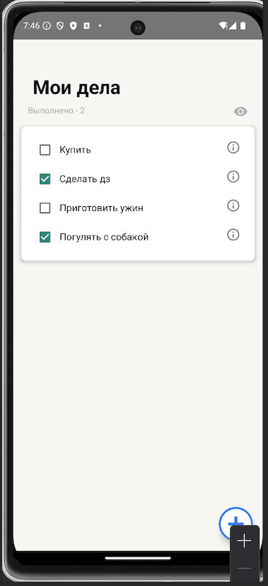

# Todo App
Приложение для управления задачами, включающее функции добавления, редактирования, удаления и пометки выполнения задач. Приложение позволяет пользователям эффективно организовывать свои дела с помощью свайпов и анимаций, а также предоставляет удобный интерфейс для работы с задачами.

---
## Установка и запуск

1. Склонируйте репозиторий:
```bash
git clone https://github.com/Egorbobkov/Project_ToDo_App.git
```

2. Откройте проект в Android Studio.

3. Синхронизируйте зависимости Gradle.

4. Нажмите Run или используйте комбинацию Shift + F10.

5. Выберите эмулятор или подключённое устройство для запуска.
---
## Структура проекта

### **1. MainActivity.kt**
`MainActivity.kt` — это основной экран приложения, который отображает список задач и предоставляет пользователю интерфейс для взаимодействия с задачами.
Главный экран с `RecyclerView` и кнопкой для добавления задач.


### **2. EditTaskActivity.kt**
`EditTaskActivity` отвечает за создание новой задачи и редактирование существующей. Этот экран позволяет пользователю вводить название задачи, выбирать приоритет, устанавливать дедлайн, сохранять или удалять задачу.


### **3. Task.kt**
Класс данных для задач.  
**Содержит:**
- `id`: Уникальный идентификатор.
- `name`: Название задачи.
- `priority`: Уровень важности.
- `deadline`: Дедлайн.
- `isCompleted`: Статус выполнения.

### **4. TaskAdapter.kt**
`TaskAdapter` управляет отображением задач в RecyclerView, обрабатывает свайпы для выполнения или удаления задач, а также клики на элементы задачи.

### **5. activity_main.xml**
Этот XML-файл определяет внешний вид главного экрана приложения для управления задачами. Он использует `ConstraintLayout` для гибкой и адаптивной верстки.

#### *Основные элементы интерфейса:*

- `Заголовок экрана (TextView)`
- `Индикатор выполненных задач (TextView)`
- `Иконка-глаз (ImageView)`
- `Список задач (RecyclerView)`
- `Кнопка добавления задачи (FloatingActionButton)`


### **6. activity_edit_task.xml**
Этот класс отвечает за экран создания и редактирования задач в приложении.

---

## Пример работы приложения:

1. Главный экран `MainActivity`


2. Экран редактирования задачи `EditTaskActivity`


3. Выбор важности и дедлайна:


4. Список задач:




